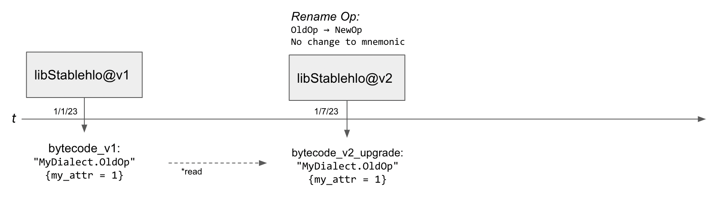
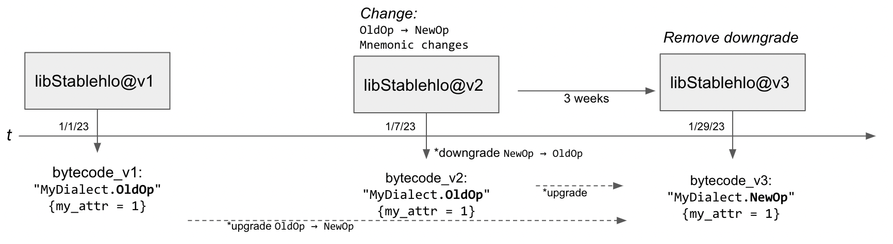
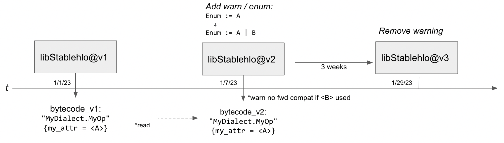
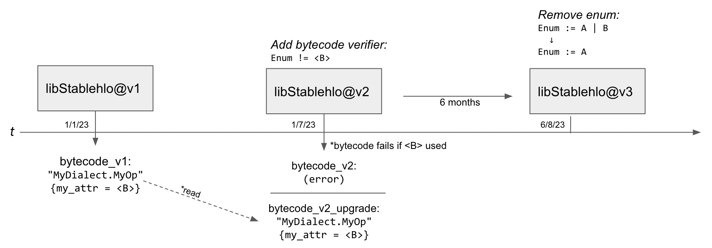
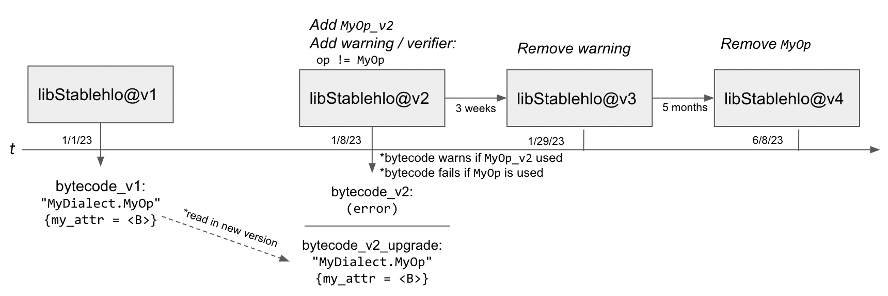
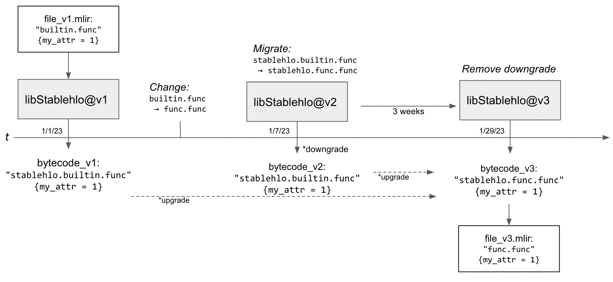

# StableHLO Compatibility

## Compatibility Guarantees

(G1) libStablehlo provides 6 months of backward compatibility, i.e. StableHLO programs serialized by an old version of libStablehlo have the same semantics when deserialized by new versions of libStablehlo within the compatibility window.

(G2) libStablehlo provides 3 weeks of forward compatibility, i.e. StableHLO programs serialized by a new version of libStablehlo have the same semantics when deserialized by old versions of libStablehlo within the compatibility window, unless they are using new features introduced since the old version.

(G3) Source compatibility for C, C++ and Python APIs within libStablehlo is an aspirational goal. At the moment, we don't offer source compatibility guarantees, but please let us know if this is an important use case for you, and we can have a discussion about supporting it.

\*StableHLO semantics is defined by the StableHLO specification and can be tested using the StableHLO interpreter. While we're bootstrapping the StableHLO specification, we will be referring to a combination of [XLA's Operation Semantics](https://www.tensorflow.org/xla/operation_semantics) and existing implementations to define the semantics.

## StableHLO Programs

For the purposes of compatibility guarantees, we define StableHLO programs as MLIR programs that include ops, attributes, and types specified below. This definition is based on our experience with lowering JAX/PyTorch/TensorFlow programs to MHLO and interviewing various groups using MHLO. Please let us know if you're interested in expanding this definition, and we can have a discussion about this.

|  Dialect     | Ops, attributes and types |
| ------------ | ----------- |
| Arith        | `AddIOp, CmpIOp, CmpIPredicateAttr, ConstantOp, DivSIOp, ExtSIOp, IndexCastOp, MaxSIOp, MinSIOp, MulIOp, SelectOp, SubIOp, TruncIOp` |
| Builtin      | No ops, but all attributes and types. |
| CHLO         | All ops, attributes and types. |
| Func         | `CallOp` |
| MLProgram    | All ops, attributes and types. |
| SparseTensor | Aspirational (pending the sparsity RFC which is expected in Q4 2022). |
| StableHLO    | All ops, attributes and types except `CustomCallOp` whose semantics is implementation-defined. |
| Tensor       | `CastOp, DimOp, FromElementsOp` |

We will provide a pass `--stablehlo-compatibility-check` which succeeds if a given program is fully covered by these compatibility guarantees and fails if it doesn't.

## Compatibility Protocols

### Compatible Changes
_Characteristics of a compatible change:_

- Does not break forward or backward compatibility.
- May require updating Python/C APIs.

_Example:_ Rename an operation, but not the mnemonic `OldOp → NewOp` _(recent example: `SinOp → SineOp`)_.

_Compatibility Protocol:_

_Description:_
- 1/1/23: Create bytecode_v1 from libStablehlo@v1
- 1/7/23: Rename `OldOp → NewOp`, mnemonic remains `MyDialect.OldOp` in libStablehlo@v2
  + No change to serialization / deserialization
  + Requires changes to users of other libStablehlo APIs
  + Backward compatibility: bytecode_v1 has the same semantics in libStablehlo@v2.
  + Forward compatibility: bytecode_v2 has the same semantics in libStablehlo@v1.

### Migration Change
_Characteristics of a migration change:_
- Change in dialect breaks serialization in a semantically compatible manner (IR able to be upgraded/downgraded).
- Downgrade bytecode for 3 weeks.
- Upgrade bytecode for 6 months.

_Example:_ Rename an operation mnemonic, `OldOp → NewOp` _(possible future example: `cross-replica-sum → cross_replica_sum`)_.

_Compatibility Protocol:_

_Description:_
- 1/1/23: Create bytecode_v1 from libStablehlo@v1
- 1/7/2023: Rename op and mnemonic `OldOp → NewOp`, build libStablehlo@v2
  + Need upgrade / downgrade hooks (before and after serialization) to achieve forward and backward compatibility. We'll communicate this feature request to MLIR upstream and will work with the community to evaluate and potentially implement it.
  + Backward compatibility: In libStablehlo@v2, when deserializing `OldOp` from bytecode_v1, upgrade it to `NewOp`.
  + Forward compatibility: In libStablehlo@v2, when serializing `NewOp` during the forward compatibility window, downgrade it to `OldOp`, so that libStablehlo@v1 can handle bytecode_v2.
- 1/29/23: Create bytecode_v3 from libStablehlo@v3
  + Forward compatibility: Window has closed, no need for downgrade anymore.
  + Backward compatibility: Maintain upgrade until compatibility window closes.

### Addition Change
_Characteristics of a addition change:_
- A new feature is introduced, with new semantics.
- No forward compatibility guarantees when feature is used.
- Warn on forward incompatibility if serializing new feature during the forward compatibility window.

_Example:_ Change enum `Enum` which has value `<A>` to add a new value `<B>`.

_Compatibility Protocol:_

_Description:_
- 1/1/23: Create bytecode_v1 from libStablehlo@v1
- 1/7/2023: Add enum value `<B>` which has new semantics in libStablehlo@v2
  + No need to create a new version of the op or to write upgrade / downgrade hooks.
  + Backward compatibility: libStablehlo@v2 can handle `<A>` from bytecode_v1.
  + Forward compatibility: libStablehlo@v1 can handle `<A>` from bytecode_v2, but `<B>` from bytecode_v2 doesn't fall under provided compatibility guarantees because it's a new feature. During the forward compatibility window, `--stablehlo-compatibility-check` will emit a warning if it sees `<B>`.
- 1/29/23: Remove warning in libStablehlo@v3
  + Backward compatibility: Nothing changes from 1/7/2023.
  + Forward compatibility: Window has closed, no need to emit warning anymore.

### Deprecation Change
_Characteristics of a deprecation change:_
- Remove a feature with backwards compatibility
- Prevent creation of new bytecode using feature
- Clean up after backward compatibility window

_Example:_ Change enum `Enum` which has values `<A>` and `<B>` to remove value `<B>`.

_Compatibility Protocol:_

_Description:_
- 1/1/23: Create bytecode_v1 from libStablehlo@v1
- 1/7/23: Add compatibility check to prevent serialization of `<B>` in libStablehlo@v2
  + Backward compatibility: libStablehlo@v2 can deserialize `<A>` and `<B>` from bytecode_v1.
  + Forward compatibility: libStablehlo@v1 can handle `<A>` from bytecode_v2. libStablehlo@v2 prevents the serialization of `<B>`.
- 6/8/23: Remove `<B>` deserialization and enum value in libStablehlo@v3.
  + Ensure that numeric value of other enums does not change due to deletion.
  + Backward compatibility: Window has closed, no need to maintain `<B>`.
  + Forward compatibility: No changes required, libStablehlo@v2 can handle all libStablehlo@v3 programs.

### Versioned Op Change
_Characteristics of a change that requires versioning:_
- A change is introduced that cannot be upgraded / downgraded
- Create new version of legacy op
- A combination of Addition/Deprecation Protocols from there

_Example:_ Changing the signature and semantics to an op, adding an operand.

_Compatibility Protocol:_

_Description:_
- 1/1/23: Create bytecode_v1 from libStablehlo@v1
- 1/7/23: Add compatibility check to prevent serialization of `MyOp` in libStablehlo@v2
  + Forward compatibility: Add check so `--stablehlo-compatibility-check` emits a warning if `MyOp_v2` is used and cannot be downgraded.
  + Backward compatibility: No change in deserialization of `MyOp`, libStablehlo@v2 can handle bytecode_v1.
- 1/29/23: Remove forward compatibility warning 
- 6/8/23: Remove `MyOp` in libStablehlo@v4
  + Backward compatibility window over.
  + Optionally rename `MyOp_v2` to `MyOp` via Migration Protocol

### Changes in Dependent Dialects
StableHLO will use forks of supported operations in dependent dialects for serialization / deserialization only. These forked operations allow StableHLO a finer control of the compatibility changes of operations in other dialects using the protocols above.

_Proposal:_
- Have stable shims of supported operations in other dialects.
- Downgrade IR to shim before serializing `arith.addi → stablehlo.arith.addi`
- Upgrade IR to other dialect on deserialization.

With the above rules, we are able to provide compatibility guarantees for Migration and Additions. 

_Example:_ Move `builtin.func → func.func`.

There are still some open questions that require more discussion, regarding semantic changes or breaking changes to ops in other dialects. One option would be to do a deeper copy of the op into StableHLO and support it in our interpreter and transformations.

## Compatibility Testing

### Detecting Backward Incompatibility
An approach similar to [LLVM bitcode compatibility testing](https://llvm.org/docs/DeveloperPolicy.html#ir-backwards-compatibility) can be used to detect backwards incompatibilities in StableHLO deserialization:
> “After each X.Y release, compatibility.ll must be copied to compatibility-X.Y.ll. The corresponding bitcode file should be assembled using the X.Y build and committed as compatibility-X.Y.ll.bc.”

There are large FileCheck integration tests for StableHLO (`ops_stablehlo_roundtrip.mlir`) and CHLO (`ops_chlo_roundtrip.mlir`). Simple breaking changes in backwards compatibility can be statically detected locally and in the “Build and Test” GitHub Action using the following procedure:

- Create versions of the roundtrip files at certain increments.
  + Create a copy as `ops_stablehlo_roundtrip_2022_09_06.mlir` and serialized `ops_stablehlo_roundtrip_2022_09_06_bc.mlir` for version created on Sep 6, 2022. 
  + Copies of this file older than 6 months can be removed.
  + The creation of these files should be scripted for easy testing, and we can automate this with GH actions as well.
- In the most recent version of libStablehlo, deserialize all bytecode files from previous revisions.
- Any failures to deserialize indicate a backwards incompatibility.

This method has a bit of churn, we could automate the update of these files at a regular cadence to take the burden off the developer. Automate an update of the bytecode file every week.

To ensure semantic guarantees, a more in-depth dynamic test suite using the interpreter will also be provided, and similarly versioned. This can be used to test result values and error cases across verisons.

### Detecting Forward Incompatibility
The IR structure of a program should not change during the forward incompatiblity window. Because of this, forward incompatibilities can be more reliably tested statically. A method similar to backward compatibility testing can be used, except with an older verion of the libStablehlo for testing.

A GitHub Action named “Forward Compatibility Testing” can be added which does the following:
- Checkout the repo at a commit from 3 weeks ago and build.
- Fetch all the newer serialized revisions of `*_roundtrip_*` files, as described in Backward Compatibility Testing.
- Deserialize and run FileCheck tests for all serialized files dated between the checked out version and most recent version.
  + _Note:_ The FileCheck checks in `*_roundtrip_*` files should use generic format, to prevent compatible changes like pretty print engancements from causing failures.
- A failure during deserialization or FileCheck comparison indicates a forwards incompatibility.
