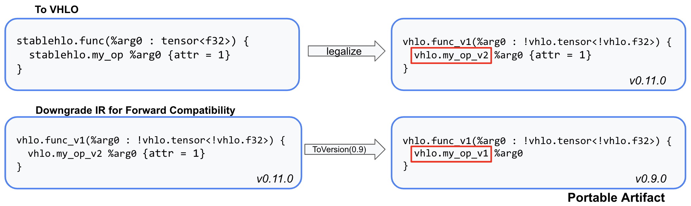
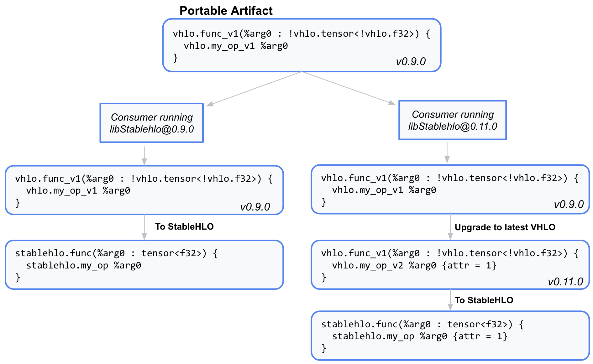

# The VHLO Dialect

## What is the VHLO Dialect?

The VHLO (Versioned StableHLO) Dialect is used for serialization and stability.
It provides a snapshot of the StableHLO dialect at a given point in time,
denoted by version number.

VHLO is an **add-only dialect** with **versioned ops**, which means that once an
op is added to the dialect, it cannot be modified in any way that impact the
ops semantics.

Any changes to an op require a new version of an op to be added to the dialect.
For example, if a hypothetical `my_op` was added to StableHLO in 0.9.0, but
was changed in 0.11.0, we would have the following in VHLO:

```tablegen
// This represents the StableHLO version of the op from 0.9.0 -> 0.10.0
def VHLO_MyOpV1 : VHLO_Op<"my_op", "0.9.0", "0.10.0"> {
  let arguments = (ins
    VHLO_AnyType:$operand
  );
  let results = (outs VHLO_AnyType:$result);
}

// This represents the StableHLO version of the op from 0.11.0 -> current
def VHLO_AllToAllOpV2 : VHLO_Op<"all_to_all_v2", "0.11.0", "current"> {
  let arguments = (ins
    VHLO_AnyType:$operand,
    VHLO_AnyAttr:$new_attribute  // New attribute added to StableHLO in 0.11.0
  );
  let results = (outs VHLO_AnyType:$result);
}
```

Note that under this schema, the latest version of an op directly represents
the StableHLO equivalent of the op.

## Why is this necessary?

Having an add-only snapshot dialect allows us to target previous versions of
the StableHLO opset. This reduces forward and backward compatibility to MLIR
conversions between ops in the VHLO dialect.

**Forward compatibility:** If every op in a program can be downgraded to the
target version, it is guaranteed to be deserializable and convertable to
StableHLO on a consumer running a version <= the target version, since VHLO
has a snapshot of the opset at that time.



This downgrade conversion will fail if ops or features that do not exist in the
previous version of the opset are used. This means that forward compatibility
are discovered on the producer, rather than at runtime.

**Backward compatibility:** Backward compatibility is provided by upgrading
VHLO ops to their latest version (if needed), then converting an op back to
StableHLO. All VHLO programs are upgradable to StableHLO, meaning different
versions of consumers can deserialize the same VHLO payload from a previous
version.



More importantly, VHLO is abstracted behind serialization. This means that ML
frameworks (producers) only need to target StableHLO ops, and compiler
backends (consumers) only need to support the latest version, which is the
StableHLO op set. Conversions to and from VHLO are taken care of with machinery
maintainted in the StableHLO repo.

## Create a portable artifact from a StableHLO program

MLIR Bytecode Format is the serialization format VHLO uses to offer
compatibility guarantees. See [bytecode.md](https://github.com/openxla/stablehlo/blob/main/docs/bytecode.md)
for more information.

Stable artifacts can be created using either the opt tool, or directly in C++
or Python APIs.

The following examples use a StableHLO program in a file called `file.mlir`
and downgrades to version `0.9.0`. All _"vhlo-to-version"_ related passes are
optional and should only be used if forward compatibility is needed.

### Using the `stablehlo-opt` tool

This is the easiest way to create and read a stable artifact. MLIR passes and
flags can be used to convert and serialize programs.

```bash
# Create a bytecode
$ stablehlo-opt <file.mlir> --stablehlo-legalize-to-vhlo --vhlo-to-version='target=0.9.0' --emit-bytecode > stable_file.mlir.bc

# Load program (guaranteed within compatibility window)
# Works on both the old and new versions of libStablehlo
$ stablehlo-opt stable_file.mlir.bc --vhlo-to-version='target=current' --vhlo-legalize-to-stablehlo
```

### Using C++ APIs

For programmatic workflows, StableHLO provides passes to conver mlir modules:

```c++
#include "stablehlo/transforms/Passes.h"

// Convert StableHLO to VHLO, downgrade if needed
PassManager pm(&context);
pm.addPass(stablehlo::createStablehloLegalizeToVhloPass());
pm.addPass(stablehlo::createVhloToVersionPass({"0.9.0"}));
if (!succeeded(pm.run(*module))) {
  return failure();
}

// Upgrade VHLO, convert to StableHLO
PassManager pm(context);
pm.addPass(stablehlo::createVhloToVersionPass({"current"}));
pm.addPass(stablehlo::createVhloLegalizeToStablehloPass());
if (!succeeded(pm.run(**module))) {
  return failure();
}
```

Bytecode can be written using [writeBytecodeToFile](https://mlir.llvm.org/doxygen/namespacemlir.html#ae60045f177ed8332dba883593aaabea8)
and read using [parseSourceFile](https://mlir.llvm.org/doxygen/namespacemlir.html#a731c3e653fe7b19e18f2ca619aa763fa)
or [parseSourceString](https://mlir.llvm.org/doxygen/namespacemlir.html#a44bf3f5340c3c0e98c02de173392fe8c).

### Using Python APIs

These APIs are still being designed. Please let us know if these APIs are
needed to help us adjust timeline and planning.
